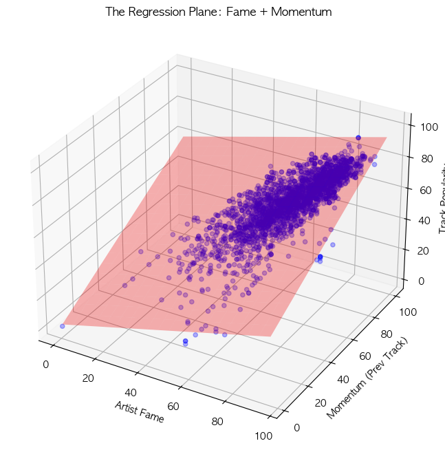
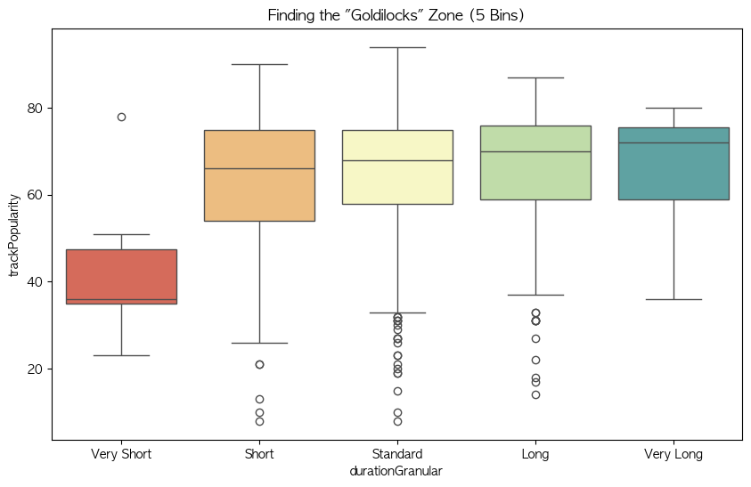
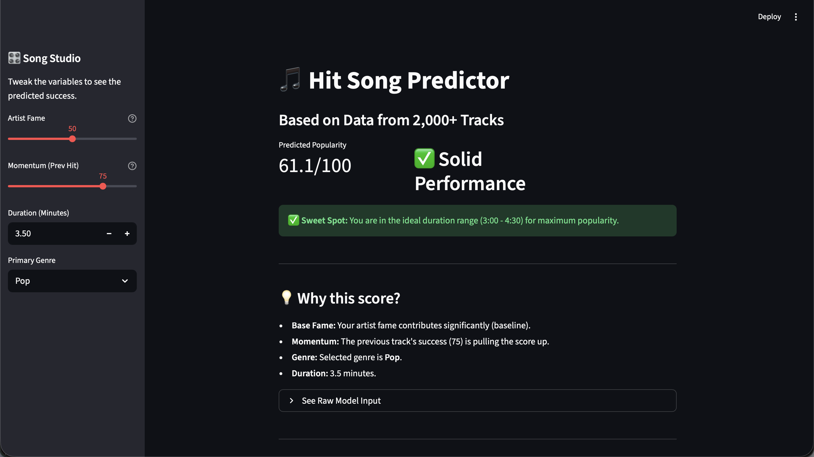

# 🎵 Hit Song Predictor: Apple Music Data Analysis


> **"Is a hit song made or born?"**
> A machine learning project that analyzes Apple Music metadata and Spotify popularity metrics to predict track success.

## 🔗 Try the App
👉 **[Click here to try the Hit Song Simulator](https://hit-song-predictor-mmjufawd7twrfbgoysiwkf.streamlit.app)**

---

## 📌 Project Overview
What determines the success of a song in the streaming era?
This project bridges the gap between **Apple Music's rich metadata** and **Spotify's popularity metrics** to perform a Multivariate Regression Analysis. The goal was to quantify the impact of artist fame, momentum, genre, and track duration on a song's performance.

### 🎯 Key Objectives
1. **Data Engineering:** Merged Apple Music metadata (Genre, Duration, etc.) with Spotify Popularity scores as a proxy metric.
2. **Statistical Analysis:** Conducted OLS Regression to identify significant predictors.
3. **Predictive Modeling:** Built a model with **$R^2 = 0.703$**, explaining 70% of the variance in popularity.
4. **HCI & Application:** Developed an interactive "Hit Song Simulator" dashboard for music producers to test "What-If" scenarios.

---

## 📊 Key Findings

### 1. The "Formula" for Success ($R^2 = 0.70$)
The analysis revealed that **Momentum** and **Fame** are the dominant drivers of success.
- **Momentum:** A hit song acts as a springboard; high popularity on a previous track significantly boosts the next one (`coef = 0.54`).
- **Fame:** Established artist popularity acts as a safety net against failure (`coef = 0.42`).


### 2. The "2-Minute Cliff" (Duration Analysis)
By binning song duration into 5 distinct categories, I discovered a non-linear relationship.



* **The Cliff (< 2 mins):** Songs under 2 minutes suffer a massive penalty (~20 point drop in popularity).
* **The Sweet Spot (3:00 - 4:30):** This range maximizes the probability of a high score.
* **Survivorship Bias (> 6 mins):** Very long songs do not crash in popularity, likely because they are mostly released by established artists with dedicated fanbases.

### 3. Genre & Content Insights
* **Cleaned vs. Explicit:** Surprisingly, "Cleaned" versions of songs performed best, likely due to wider accessibility (radio play) combined with the virality of the original content.
* **Genre Bonus:** While most genres performed similarly, **Singer/Songwriter** tracks received a statistically significant boost (`+2.79` points).

---

## 💻 Features (The Dashboard)

### 🎛️ Hit Song Simulator
I built a Streamlit web application to make the regression model accessible to non-technical users.



* **Interactive Sliders:** Users can tweak variables (Fame, Duration, Genre) to see real-time predictions.
* **Visual Feedback:** The interface provides warnings (e.g., "⚠️ Penalty: Song is too short") based on data insights.
* **Batch Analysis:** Users can upload a CSV file of demo tracks to process predictions in bulk.

---

## 🛠️ Tech Stack
* **Language:** Python 3.9
* **Data Analysis:** Pandas, NumPy
* **Statistics:** Statsmodels (OLS Regression), Scipy
* **Visualization:** Matplotlib, Seaborn
* **Web Framework:** Streamlit

---

## 🚀 How to Run Locally

### 1. Clone the repository
```bash
git clone [https://github.com/lucytheboss/apple-music-analysis.git](https://github.com/your-username/apple-music-analysis.git)
cd apple-music-analysis
```
2. Install dependencies
```Bash
pip install -r requirements.txt
```
3. Run the App
```Bash
streamlit run app.py
```

---

## 📝 Limitations & Future Work
- **Data Proxy**: Spotify popularity was used as a proxy for Apple Music performance due to API limitations. User behavior may differ between platforms.
- **External Factors**: The model explains 70% of the variance. The remaining 30% is likely driven by unmeasured external factors such as marketing budgets, TikTok trends, and social media buzz.
- **Future Work**: Incorporating social media sentiment analysis (NLP) could improve the model's accuracy.
